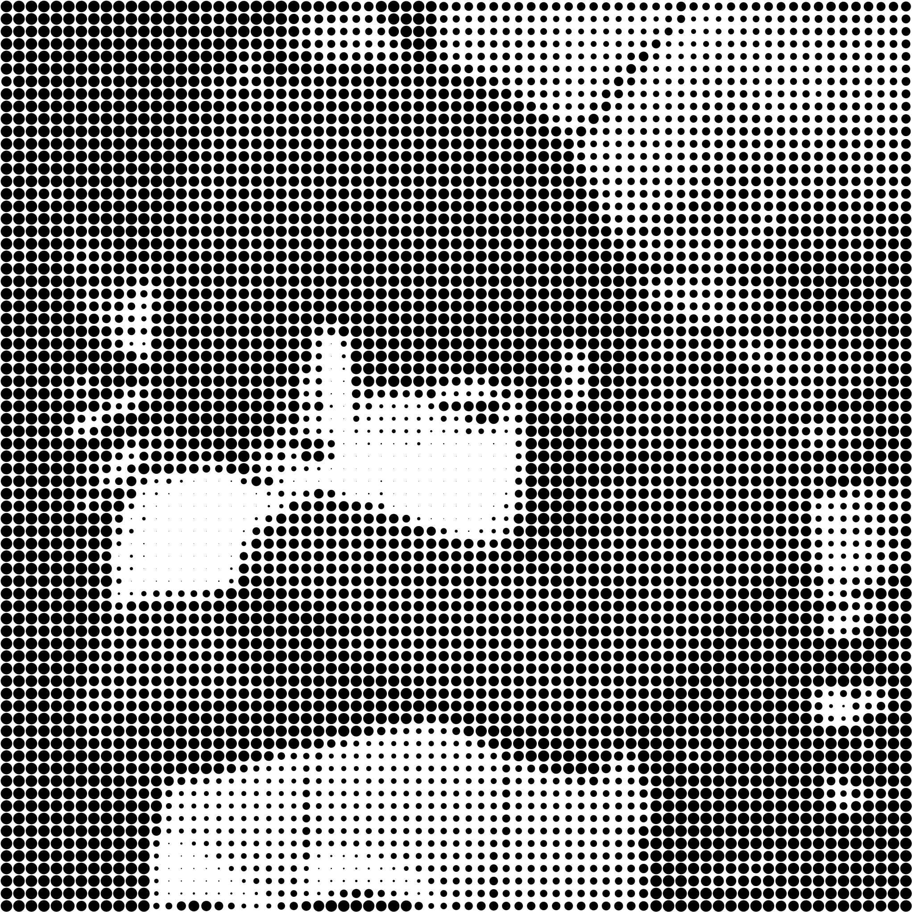
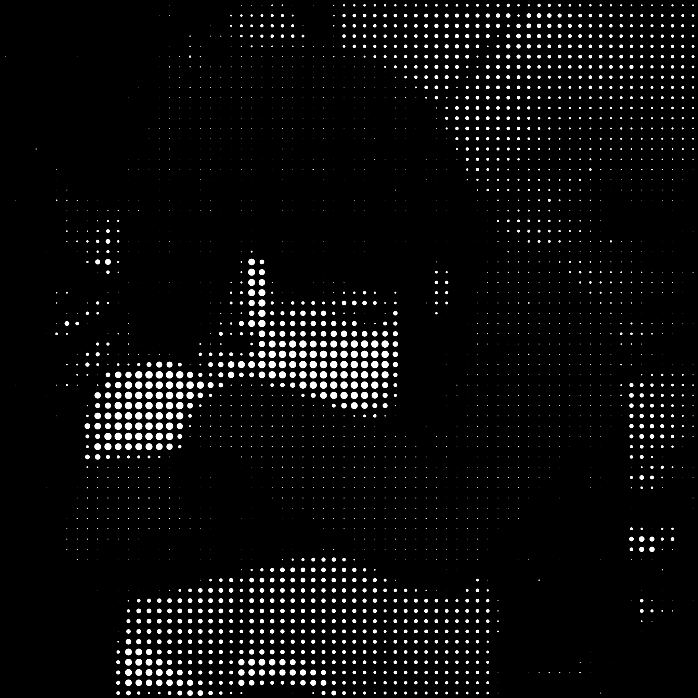

# Dotify
a basic utility to add a dot matrix effect to an image
with basic control on the output

# Dependencies
- python3
- pillow
- numpy

## Intall dependencies
```shell
pip3 install pillow
pip3 install numpy
```

# Usage
```
Usage:
python dotify.py <input_image_path> <dot_size> [--invert] [--black-dots] [--normalize]
                                             [--spread <spread>] [--exposure <exposure>] [...]

Mandatory arguments:
  <input_image_path>: path to input image
  <dot_size>: integer greater than 1 representing the size of a dot in pixel

Options:
  --invert: inverse the original image
  --black-dots: by default the image is white dots on a black background, 
                when this arguments is passed: black dots on a white background

  --normalize: normalize the input image (the brightest pixel will be white and the darkest black)
  --spread <spread>: float the distance between 2 dots (default = 0.5)
  --expossure <expossure>: float the sensitivity to brightness (between 0.1 and 10, default = 2)
  
  -h, --help: display this message
```

# Examples
## original image


## variation 1


## variation 2

